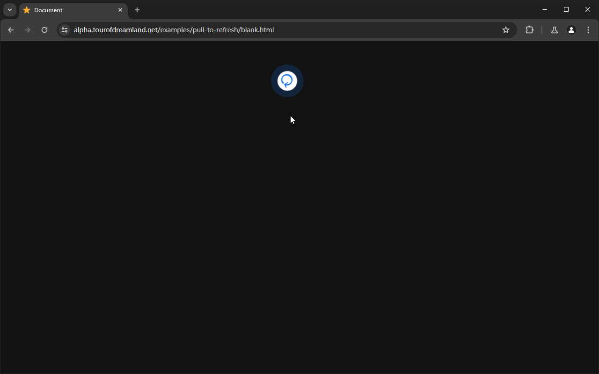

# Pull to refresh

A browser extension used to support pull-to-refresh with touchscreens and precision touchpads, to provide an equivalent feature of [Pull to refresh](about://flags/#pull-to-refresh) which was remove from desktop Chromium since v100.

## Compatibility 

| Browser \\ Platform | Windows               | macOS        | Linux        |
| ------------------- | --------------------- | ------------ | ------------ |
| Chrome, Edge        | touchscreen, touchpad | touchscreen  | *not tested* |
| Firefox             | touchscreen           | *not tested* | *not tested* |

You may disable browser overscroll effect if bothered.
For Microsoft Edge, open edge://flags/#elastic-overscroll, select Disabled.
For Firefox, open about:config, set apz.overscroll.enabled to false.

## Usage

Pull page down.
When pulled by 1/3 of viewport height, an indicator will be visible.
When pulled by 2/3 of viewport height, the indicator will be active.

## Features

This extension respects website settings, it tries not to mess up with some interactive web apps, its pull behavior will be prevented when

+ CSS `overscroll-behaviour-y: none` is set on body
+ CSS `touch-action: none` is set on body or on target element (e.g. canvas)
+ JavaScript `event.preventDefault()` is called in `touchstart` / `touchmove` / `wheel` event listener

